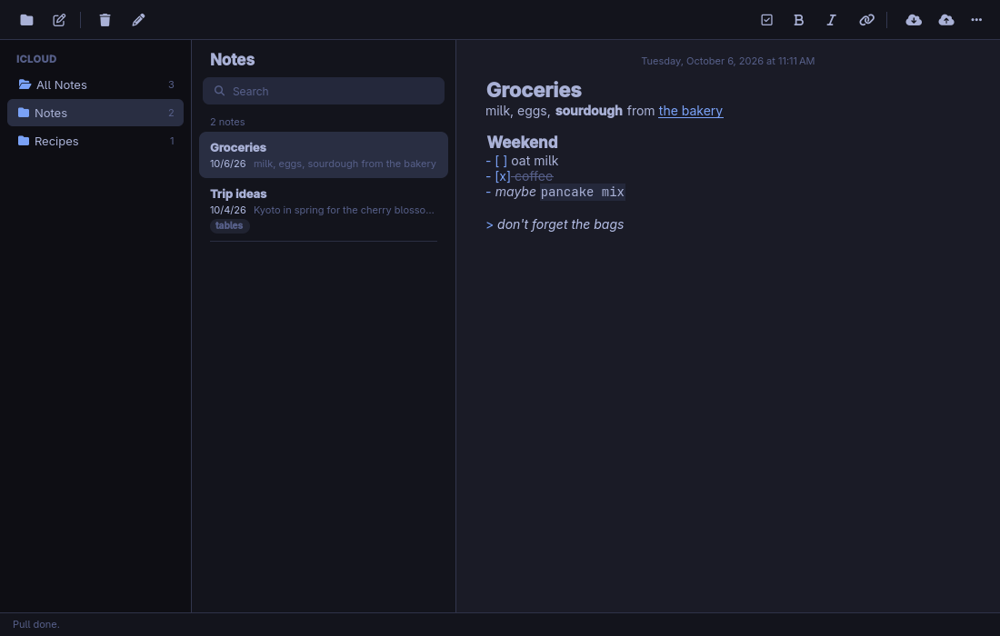
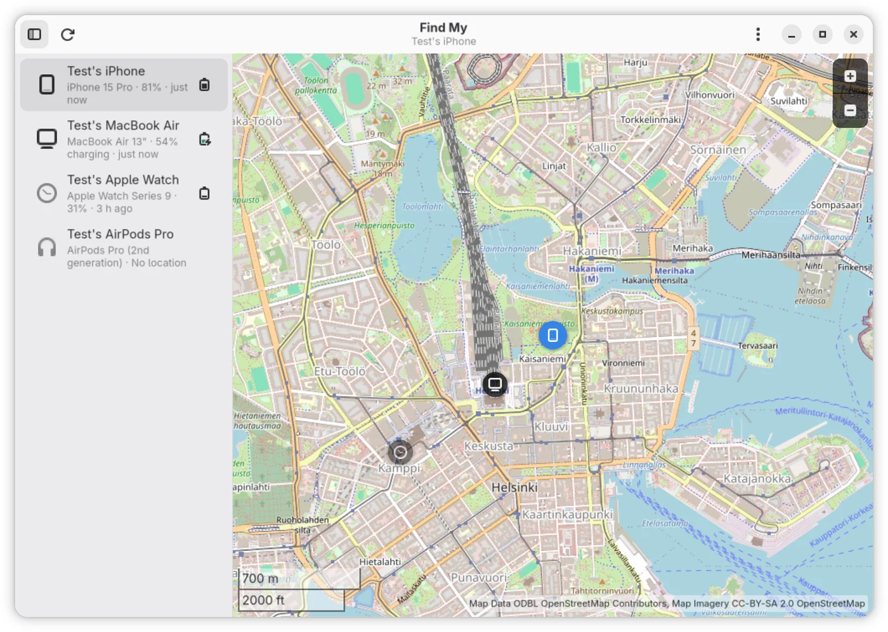
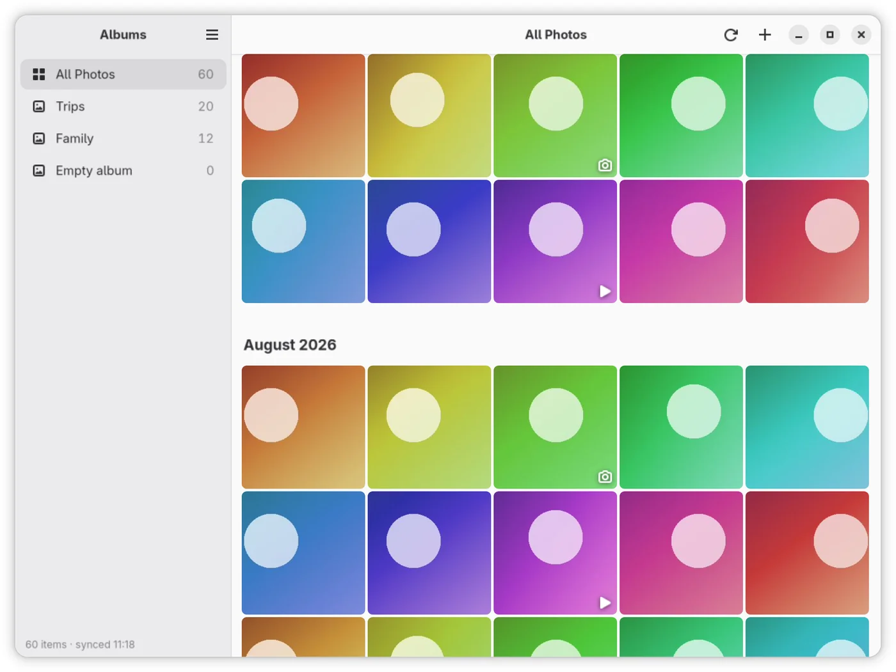

# icloud-for-omarchy

iCloud apps for [Omarchy](https://omarchy.org) (and any Arch Linux), sharing
one Apple sign-in, published as one signed pacman repository.

- **Notes**: your Apple Notes as a folder of Markdown files, synced both
  ways. Edit, rename, move or delete them in the app, in Neovim or Obsidian,
  or with `mv` and `rm`, and iCloud follows.
- **Photos**: browse, download, upload and delete your iCloud Photos.
- **Find My**: your devices on a map, with play sound, Lost Mode and a
  location trail.
- **Reminders**: your lists and reminders, completed with a click, and a
  desktop notification when one falls due, window open or not.
- Every window action also works from the terminal, with `--json` output
  for scripts and AI agents.

```bash
curl -fsSL https://github.com/ferdousbhai/icloud-for-omarchy/releases/latest/download/install.sh | sudo bash
```





<sub>Screenshots use demo data.</sub>

| Directory | Package | What it is |
|---|---|---|
| [notes/](notes/README.md), [notes-sync/](notes-sync/README.md) | `icloud-notes` | Apple Notes as a Qt/QML app and the `icloud-notes` command, synced with iCloud by its engine, icloud-notes-sync (notes-sync/, in Rust, originally derived from icloud-md), which the package installs off PATH. |
| [photos/](photos/README.md) | `icloud-photos` | iCloud Photos in GTK4/libadwaita: browse, download, upload and delete. |
| [findmy/](findmy/README.md) | `icloud-findmy` | Find My devices in GTK4/libadwaita: locate, play a sound, Lost Mode, history trail. |
| [reminders/](reminders/README.md) | `icloud-reminders` | iCloud Reminders in GTK4/libadwaita, and a systemd timer that notifies through Omarchy's notifications when a reminder falls due. |
| [session/](session/README.md), [sessiond/](sessiond/) | `icloud-session` | The shared sign-in: a D-Bus daemon, a sign-in window and a CLI (sessiond/), plus the Rust client crate every app links (session/). |

The shared sign-in's design (the daemon, its D-Bus interface, the session
files) is in [session/README.md](session/README.md#design).

## Command line and agents

Everything the windows do can be done from a terminal, or by an AI agent:
`icloud-notes`, `icloud-photos`, `icloud-findmy` and `icloud-reminders`
take commands (`icloud-notes list`, `icloud-photos download`,
`icloud-findmy locate`, `icloud-reminders add`, ...)
and run them without a window, and `icloud-session` owns the sign-in. They
share `--json` output, one JSON error shape and one table of exit codes.

- [docs/AGENTS.md](docs/AGENTS.md): the reference to give an agent (auth,
  commands with example JSON, safety rules, recipes).
- [docs/skills/icloud/SKILL.md](docs/skills/icloud/SKILL.md): the same as a
  Claude Code skill; copy `docs/skills/icloud` into `~/.claude/skills/`.
- [docs/CLI.md](docs/CLI.md): every GUI feature mapped to its command, the
  exit and error codes, the JSON shapes.

Signing in is the one thing a person must do: Apple's page (password, 2FA)
opens in a window from `icloud-session sign-in`.

## Is this safe?

- **You sign in on Apple's own page**, password and two-factor code
  included, in a window opened by `icloud-session sign-in`. The apps never
  see your password.
- **What's kept** is the session cookies, in your system keyring (the
  Secret Service, e.g. GNOME Keyring). Only who is signed in and when the
  session was last checked are in a file,
  `~/.local/state/icloud-session/account.json`, readable only by you.
- **Your password is stored only if you choose to**, for Find My, which asks
  for it again from time to time: `icloud-session set-password` puts it in
  your system keyring (the Secret Service, e.g. GNOME Keyring), and
  `icloud-session forget-password` removes it.
- **The apps talk only to Apple**, plus OpenStreetMap for Find My's map
  tiles.
- **Notes and Reminders deletes are recoverable**: a note or reminder you
  delete goes to Recently Deleted in iCloud (about 30 days).
- **It's all open source**, and the packages are signed with a key whose
  fingerprint is pinned in [install.sh](install.sh).

## Install

```bash
curl -fsSL https://github.com/ferdousbhai/icloud-for-omarchy/releases/latest/download/install.sh | sudo bash
```

installs all four apps (icloud-notes, icloud-photos, icloud-findmy,
icloud-reminders), which pull in icloud-session. To install only some, name them:

```bash
curl -fsSL .../install.sh | sudo bash -s -- icloud-photos icloud-findmy
```

The script ([install.sh](install.sh)) trusts the package-signing key (after
checking it against the fingerprint pinned in the script), adds the signed
`[icloud-for-omarchy]` repository on x86_64, or `[icloud-for-omarchy-aarch64]`
on aarch64, with the matching `/etc/pacman.d/<repository>.conf`
with an `Include` line in `/etc/pacman.conf`, installs an Omarchy
`pre-refresh-pacman` hook that restores the repository after
`omarchy refresh pacman`, and installs the packages in one `pacman -Syu`.
Re-running it is safe. Updates then arrive with `omarchy update`.

### Install by hand

Rather not pipe a script into `sudo bash`? These are the same steps, one
at a time:

```bash
# 1. Download the package-signing key and check its fingerprint is
#    35C47A06567940B6796B4D0F9B3C7BDF85268B31
# These manual steps use the x86_64 repository. On ARM, use the installer above
# or replace icloud-for-omarchy with icloud-for-omarchy-aarch64 in repository/key names.
curl -fsSLO https://github.com/ferdousbhai/icloud-for-omarchy/releases/latest/download/icloud-for-omarchy-signing-key.asc
gpg --show-keys icloud-for-omarchy-signing-key.asc

# 2. Let pacman trust it
sudo pacman-key --add icloud-for-omarchy-signing-key.asc
sudo pacman-key --lsign-key 35C47A06567940B6796B4D0F9B3C7BDF85268B31

# 3. Add the signed repository
printf '[icloud-for-omarchy]\nSigLevel = Required DatabaseRequired\nServer = https://github.com/ferdousbhai/icloud-for-omarchy/releases/latest/download\n' \
  | sudo tee /etc/pacman.d/icloud-for-omarchy.conf
echo 'Include = /etc/pacman.d/icloud-for-omarchy.conf' | sudo tee -a /etc/pacman.conf

# 4. Install (on Omarchy: sudo pacman -Sy && omarchy-pkg-add icloud-notes icloud-photos icloud-findmy icloud-reminders)
sudo pacman -Syu icloud-notes icloud-photos icloud-findmy icloud-reminders
```

On Omarchy, `omarchy refresh pacman` rewrites `/etc/pacman.conf`; the
script installs a hook that adds the `Include` line back, so by hand you
would re-add it after a refresh.

On ARM, rerunning the installer removes the incompatible x86_64 repository
include, config and refresh hook before synchronizing the ARM repository.
Unsupported architectures stop before changing repository configuration.

Machines set up from earlier Notes releases, which had a repository of
their own (`[icloud-notes]`), are migrated: once `[icloud-for-omarchy]` is
added, the script removes `/etc/pacman.d/icloud-notes.conf`, its `Include`
line and its Omarchy hook.
The icloud-notes-sync package of earlier releases needs nothing from the
script: icloud-notes now carries the engine and `replaces` it, so the next
`omarchy update` swaps it out.

Every release also carries one installer per app, `install-notes.sh`,
`install-photos.sh`, `install-findmy.sh` and `install-reminders.sh`: install.sh with its default
set to that one app, generated by `bin/make-installers`. The website (not
in this repository) redirects its one-liners to these assets:
`https://ferdousbhai.com/icloud/install.sh` to `install.sh`, and
`https://ferdousbhai.com/icloud-<app>/install.sh` to that app's installer,
e.g. `.../releases/latest/download/install-photos.sh`, so
`curl ... | sudo bash` keeps installing just that app. The apps' page is
<https://ferdousbhai.com/icloud>.

To uninstall: `omarchy pkg drop <packages>`, then remove
`/etc/pacman.d/icloud-for-omarchy.conf`, its `Include` line in
`/etc/pacman.conf`, and
`~/.config/omarchy/hooks/pre-refresh-pacman.d/icloud-for-omarchy`.

## Layout

```
Cargo.toml, Cargo.lock   one Cargo workspace: session, sessiond, notes-sync, photos, findmy, reminders
session/  sessiond/      icloud-session: client crate / daemon, sign-in window, CLI
notes/                   icloud-notes (qmake project, QML, tests, its own bin/build and bin/test)
notes-sync/              icloud-notes-sync, the sync engine the icloud-notes package ships
photos/  findmy/         icloud-photos, icloud-findmy
reminders/               icloud-reminders (its systemd timer in reminders/data/)
packaging/<package>/     one PKGBUILD per package
install.sh               the one installer (per-app copies are generated at release)
bin/                     build, test, release, verify-release, make-installers; dev-install/dev-uninstall for the daemon
tests/                   the add_signed_repo hash pin; install_test.sh, the installers against stubbed pacman
docs/                    the command-line reference (CLI.md, AGENTS.md, skills/)
```

Each directory kept its history: the five former repositories
(ferdousbhai/icloud-session, icloud-notes-sync, icloud-photos, icloud-findmy
and icloud-notes) were imported with `git filter-repo` into their
subdirectories and merged, so `git log --follow` on a file reaches back past
the move. icloud-notes' release tags `v0.1.0`...`v0.3.8` are here as
`notes-v0.1.0`...`notes-v0.3.8`.

## Development

Needs `rust`, `sqlite`, `gtk4`, `libadwaita`, `libshumate` (findmy) and
`webkitgtk-6.0` (the sign-in window) for the Rust crates, and `qt6-base`,
`qt6-declarative` and `make` for Notes. The apps talk to the icloud-session
daemon over D-Bus; for development without the package, `bin/dev-install`
puts a release build of it in `~/.local/bin` with a user D-Bus activation
file (`bin/dev-uninstall` undoes it).

```bash
bin/build                       # every package; or name some: bin/build icloud-photos
bin/test                        # clippy, all Rust tests, notes/bin/test, the installer checks
tests/install_test.sh           # the installers alone: stubbed pacman, scratch /etc in a user namespace
cargo test -p icloud-findmy     # one crate
notes/bin/test                  # the Qt app's tests alone (they run on a private D-Bus)
```

Rust binaries land in `target/release/`, Notes in `notes/build/`. Each app
can also run against a local fake of Apple's servers; its README says how.

notes-sync's recorded scenarios and golden corpora run with `cargo test`;
`ICLOUD_NOTES_SYNC_REGEN=1 cargo test -p icloud-notes-sync` re-records them
from the current code (see notes-sync/README.md).

## Releasing

Releases are cut from a checkout with the package-signing key in its
keyring. Native CI builds unsigned packages; signing stays on your machine:

```bash
bin/release icloud-notes 0.4.1
bin/release icloud-session 0.3.0 icloud-notes 0.6.0   # several at once
```

Versions are per package and so are the tags: `<name>-v<version>`, where
`<name>` is the package name without `icloud-` (`session`, `photos`,
`findmy`, `notes`, `reminders`), e.g. `notes-v0.4.1`. Each PKGBUILD takes its
`pkgver` from its own newest tag: at the tag it is the plain version, and a
later commit builds `<version>.r<count>.<sha>` (`0.0.0.r<count>` for a package
never tagged).

`bin/release` runs `bin/test`, sets the named packages' versions, commits
and pushes their tags, explicitly dispatches the Native packages workflow
for that release tag, then waits for the successful run. Native
x86_64 and ARM runners build and test all five packages from that same commit.
Packages not named in the release receive their normal post-tag development
versions, rather than carrying binaries from an older release. This also
bootstraps ARM without requiring ARM assets in a previous release.

Before signing, `bin/collect-packages` checks each artifact's source commit,
package names, architecture, filename/version metadata and matching versions
across architectures. The release machine signs every package and the two
separate databases: `[icloud-for-omarchy]` for x86_64 and
`[icloud-for-omarchy-aarch64]` for aarch64. Both public key assets contain the
same pinned key. The private key never enters CI. A failed build leaves
candidate tags available for inspection and publishes no release. Once published,
main advances to the released source before installation verification.

The Notes sync engine (notes-sync/) is not released on its own: it ships
inside icloud-notes, built from the same commit, so releasing icloud-notes
releases it, and its Cargo.toml version only names the engine
(`icloud-notes-sync --version`). The `notes-sync-v*` tags are historical,
from when it was the separate icloud-notes-sync package (last
`notes-sync-v0.2.0`). Every new release rebuilds Notes with its embedded sync engine.

`bin/verify-release <release-tag> <package> <version> [...]` checks the
specified tag's installer and repository in a native Arch container, rather
than following `latest`. Set `VERIFY_ARCH=aarch64` and `ARM_BUILD_IMAGE` to a
native Arch Linux ARM image on ARM. The published-release workflow verifies
all five packages on both architectures. Infrastructure or installation
failures leave the release and tags available for diagnosis; nothing deletes
a release automatically. With `PUBLISH_CRATE=1`, releasing icloud-session also
publishes its client crate after local verification; by default it does not.

The native package workflow runs on pull requests, pushes to main and
an explicit release dispatch. To build locally, run `bin/build-packages x86_64` or, on an ARM host,
`ARM_BUILD_IMAGE=<image> bin/build-packages aarch64`. The workflow imports the
Arch Linux ARM root filesystem over HTTPS for its native ARM runner.

The `add_signed_repo` function in `install.sh` is shared verbatim with the
Ghost installer (ferdousbhai/ghost), and both repositories pin its hash in
their tests (`tests/add_signed_repo.sha256` here): change it in both places,
and both hashes, together.

### The signing key

One key signs these packages and Ghost's; its fingerprint is pinned in both
installers and it lives only in the releasing machine's keyring, protected
by a passphrase. Losing it would break the trust chain on every machine
that installed from these repositories, so keep an encrypted backup
somewhere off this machine:

```bash
gpg --armor --export-secret-keys 35C47A06567940B6796B4D0F9B3C7BDF85268B31 \
  | gpg --symmetric --armor --output package-signing-key.backup.asc
```

Restoring is `gpg --decrypt package-signing-key.backup.asc | gpg --import`.

To rotate the key: generate the new one, publish one release from each
project signed with the old key that also ships the new public key as
`<repository>-signing-key.asc`, update the pinned fingerprint in both
installers and the tests, then sign the next releases with the new key.
Machines that installed earlier pick up the new key by re-running the
one-liner, which is idempotent.

## License

MIT, see [LICENSE](LICENSE). Third-party credits (icloud-md, node-diff3,
the mdast/micromark utilities, yaml, pyicloud) are in [NOTICE](NOTICE).
